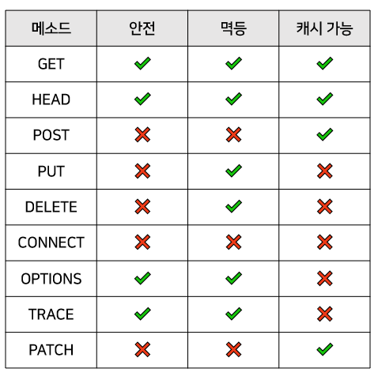

# HTTP 메서드

**HTTP**는 웹에서 데이터를 주고받는 서버-클라이언트 모델의 프로토콜입니다. 쉽게 설명하자면 웹 브라우저가 서버와 통신하는 규칙입니다. HTTP 메서드는 클라이언트가 서버에 요청을 보낼 때 사용하는 방법을 정의합니다.

## 1. GET

- **설명**: 서버에서 데이터를 요청합니다. 요청한 데이터는 URL에 포함되며, 서버는 해당 데이터를 반환합니다.
- **용도**: 웹 페이지, 이미지, 파일 등 리소스를 요청할 때 사용됩니다.
- **특징**:
  - `request body`가 없으며, URL에 쿼리 문자열을 포함할 수 있습니다.
  - 캐시 가능하며, 북마크할 수 있습니다.

## 2. POST

- **설명**: 서버에 데이터를 제출하여 새로운 리소스를 생성하거나 기존 리소스를 수정합니다.
- **용도**: 사용자 입력 데이터 전송, 파일 업로드 등.
- **특징**:
  - `request body`에 데이터를 포함할 수 있습니다.
  - 일반적으로 캐시되지 않으며, 북마크할 수 없습니다.
  - 같은 POST 요청을 여러 번 보내면 여러 개의 리소스가 생성됩니다. (멱등성이 없음)
    > 예를 들어, 같은 내용의 요청을 /data로 3번 보내면 /data/1, /data/2, /data/3과 같이 똑같은 데이터를 가진 리소스 3개가 생성됩니다.

## 3. PUT

- **설명**: 서버에 지정된 리소스를 업데이트하거나 생성합니다. 리소스가 존재하지 않으면 새로 생성합니다.
- **용도**: 리소스의 **전체 업데이트**에 사용됩니다.
- **특징**:
  - 요청 본문에 업데이트할 데이터를 포함합니다. 리소스 일부만 수정하고 싶어도 전체 필드 데이터를 요청 본문에 포함해야 합니다.
  - idempotent(멱등성)한 메서드로, 동일한 요청을 여러 번 보내도 결과가 동일합니다.
    > POST와 달리 PUT 요청은 클라이언트가 리소스의 정확한 URI를 알아야 됩니다. /data로 PUT 요청을 보내면 /data/1와 같은 리소스가 생성되지 않습니다.

## 4. DELETE

- **설명**: 서버에서 지정된 리소스를 삭제합니다.
- **용도**: 리소스 삭제 요청.
- **특징**:
  - 요청 본문이 필요하지 않습니다.
  - idempotent(멱등성)한 메서드입니다.

## 5. PATCH

- **설명**: 서버에 리소스의 부분적인 업데이트를 요청합니다.
- **용도**: 리소스의 **일부만 수정**할 때 사용됩니다.
- **특징**:
  - 요청 본문에 수정할 데이터의 일부를 포함합니다.

## 6. OPTIONS

- **설명**: 서버가 지원하는 HTTP 메서드를 요청합니다.
- **용도**: 특정 리소스에 대해 어떤 메서드가 허용되는지 확인할 때 사용됩니다.
- **특징**:
  - 요청 본문이 필요하지 않습니다.
  - CORS(Cross-Origin Resource Sharing) 요청에서 자주 사용됩니다.

## 7. HEAD

- **설명**: GET 요청과 유사하지만, `response body` 없이 `헤더`만 요청합니다.
- **용도**: 리소스의 메타데이터를 확인할 때 사용됩니다.
- **특징**:
  - `request body`와 `response body`가 없습니다.
  - 주로 리소스의 상태를 확인하는 데 사용됩니다.

## HTTP 메서드의 속성

**HTTP 메서드**의 속성은 크게 `안전`, `멱등`, `캐시 가능`이 있습니다.

- `안전`: 메서드를 호출해도 리소스가 변경되지 않는 성질
- `멱등성`: 멱등성이란 요청(Request)을 한 번을 호출하든 여러 번을 호출하든 그 결과가 같은 성질

### 참고 출처

- [HTTP 메소드의 종류와 특징, 속성 - 그냥 그냥 블로그](https://girawhale.tistory.com/66)
- [POST, PUT, PATCH의 차이점 - toss payments 블로그](https://docs.tosspayments.com/blog/rest-api-post-put-patch)
- [MDN Web Docs - HTTP Methods](https://developer.mozilla.org/ko/docs/Web/HTTP/Reference/Methods)
