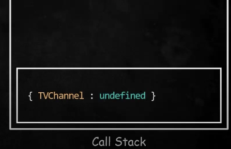
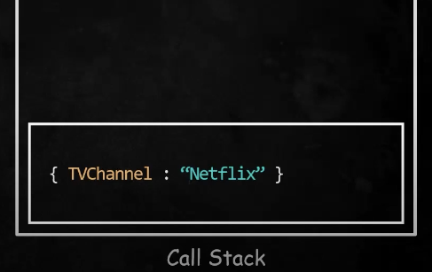
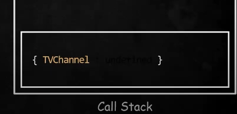
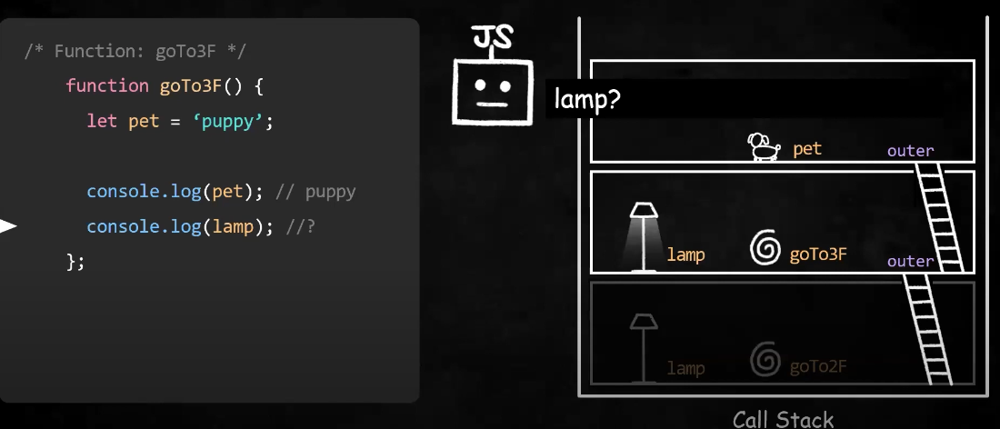
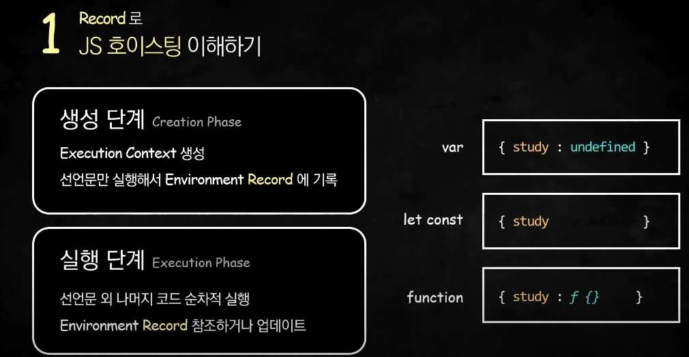
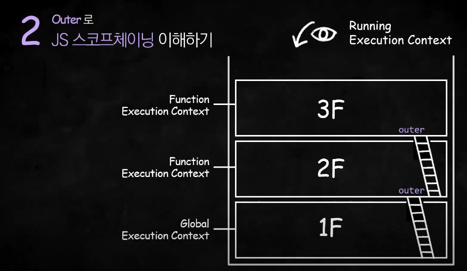

# 실행 콘텍스트 (Execution Context)

## 실행 콘텍스트의 정의

실행 콘텍스트는 자바스크립트가 실행되는 문맥입니다. 쉽게 설명하면 코드를 실행하는데 필요한 환경을 제공하는 객체라고 할 수 있습니다.

## 실행 콘텍스트의 종류

- 전역 실행 콘텍스트(Global Execution Context : GEC)
- 함수 실행 콘텍스트(Function Execution Context : FEC)
- <del>Eval 함수 실행 콘텍스트(Eval Function Execution Context)</del>

실행 콘텍스트의 종류는 3가지가 있습니다. 여기서 `Eval 함수 실해 콘텍스트`는 [MDN 공식문서](https://developer.mozilla.org/ko/docs/Web/JavaScript/Reference/Global_Objects/eval#eval%EC%9D%84_%EC%A0%88%EB%8C%80_%EC%82%AC%EC%9A%A9%ED%95%98%EC%A7%80_%EB%A7%90_%EA%B2%83!)에서 속도나 보안 문제 때문에 사용하지 말 것을 권고하기 때문에 생략하겠습니다.<br/><br/>

`전역 실행 콘텍스트(GEC)`의 경우 실행 전에 생성됩니다. 반면 `함수 실행 콘텍스트(FEC)`는 함수가 호출 될 때 생성됩니다.

## 실행 콘텍스트 스택 (Execution Context Stack)

실행 콘텍스트가 생성되면 `콜 스택`이라는 실행 콘텍스트 스택에 쌓이게 됩니다. 위에서 설명했던 것 처럼, `전역 실행 콘텍스트`는 코드가 실행되기 전에 쌓이고 모든 코드가 실행되면 `콜 스택`에서 제거됩니다. `함수 실행 콘텍스트는` 함수가 호출되는 시점에 쌓이고 함수 실행이 종료되면 제거됩니다.<br/>

## 실행 콘텍스트 구성

### VariableEnvironment

- 현재 컨텍스트 내의 식별자들에 대한 정보
- 외부 환경 정보
- 선언 시점의 LexicalEnvironment의 스냅샷 ➡️ 변경 사항은 반영되지 않음
- `es6`의 도입으로 `var`로 선언한 변수만 저장한다고 합니다.

### LexicalEnvironment

저희가 집중적으로 봐야 할 부분입니다. `LexicalEnvironment`는 크게 `Environment Record`와 `Outer Environment Reference`로 구성되어 있습니다.

- 환경 레코드(Environment Record)
  - 식별자와 식별자에 바인딩 된 값을 기록해두는 객체
  - `생성 단계(Creation Phase)`에서 선언문만 실행해서 `환경 레코드`에 기록합니다.
  - `실행 단계(Execution Phase)`에서 선언문 외 나머지 코드를 순차적으로 실행하여 `환경 레코드`를 참조하거나 업데이트 합니다.
- 외부 환경 참조(Outer Environment Reference)
  - 바깥 `LexicalEnvironment(Record + Outer)`를 가리킴
  - 현재 콘텍스트에서 변수, 함수 등을 찾지 못했을 때 상위 콘텍스트에서 해당 값에 접근하는 것

## 실행 콘텍스트 동작 - 환경 레코드드

```javascript
console.log(TVChannel);

var TVChannel = "Netflix";

console.log(TVChannel);
```

위 코드를 `생성 단계(Creation Phase)`와 `실행 단계(Execution Phase)`로 나눠서 보겠습니다.

> ### 생성 단계
>
> 생성 단계에서는 선언문만 미리 실행하여 `TVChannel`을 undefined로 초기화합니다.
> 

> ### 실행 단계
>
> 실행 단계에서는 선언문을 제외한 코드를 실행합니다.
> `console.log(TVChannel)`은 환경 레코드에 기록된 `TVChannel`를 참조해 undefined를 출력합니다.<br/>
> 이후 `TVChannel = "Netflix"`를 실행해 환경 레코드에 기록된 `TVChannel`의 값을 업데이트 합니다.<br/>
> 이후 `console.log(TVChannel)`은 환경 레코드에 기록된 `TVChannel`를 참조해 `Netflix`를 출력합니다.
> 

> 만약 `var`가 아닌 `const` 키워드를 사용해 변수를 선언하면 어떻게 될까요?
>
> ```javascript
> console.log(TVChannel);
>
> const TVChannel = "Netflix";
>
> console.log(TVChannel);
> ```
>
> <br/>
> `TVChannel`을 선언은 하였지만 초기화하지 않아 `Reference Error`가 발생할 것입니다. 이렇게 `let` 또는 `const`로 선언한 변수를 선언 이전에 참조할 수 없는 구간을 `TDZ(Temporal Dead Zone)`이라고 합니다.

## 실행 콘텍스트 동작 - 외부 환경 참조

> 실행 콘텍스트는 현재 콘텍스트에서 변수나 함수 등을 찾지 못하면 `Outer`를 이용해 외부(이전) 렉시컬 환경을 참조할 수 있습니다.
> 
> 위 예시를 보면, `lamp`의 경우 `goTo3F()` 콘텍스트에서 찾을 수 없어 `Outer`를 이용해 이전 렉시컬 환경의 `lamp`를 참조했습니다. 이때, 전역 콘텍스트에도 `lamp`가 있지만 이미 콜 스택의 2번째 실행 콘텍스트에서 `lamp`를 찾았기 때문에 더 내려갈 필요가 없습니다.<br/><br/>
> 이렇게 식별자를 결정할 때 활용하는 스코프들의 연결 리스트를 `스코프 체인`이라고 하고, 이 과정을 `스코프 체이닝`이라고 합니다.

## 요약




## 참고 자료

- [실행 콘텍스트 정리 영상](https://www.youtube.com/watch?v=EWfujNzSUmw)
- [Velog 실행 콘텍스트 정리](https://velog.io/@kwonh/ES6-Javascript-Execution-Context%EC%8B%A4%ED%96%89%EB%AC%B8%EB%A7%A5-%EC%8B%A4%ED%96%89%EC%BB%A8%ED%85%8D%EC%8A%A4%ED%8A%B8)
