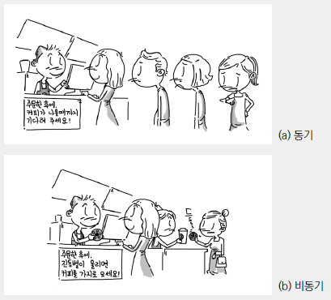
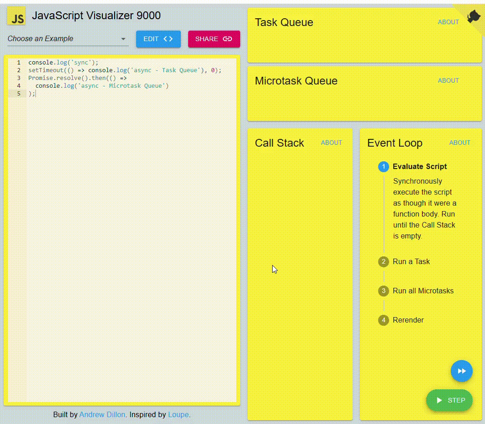

# 이벤트 루프 (Evnet Loop)

자바스크립트는 `단일 스레드(single-threaded) 기반 언어`로, 하나의 콜 스택을 갖습니다. 이는 한 번에 하나의 작업만 처리할 수 있다는 말이며, 요청이 동기적으로 처리된다는 것을 의미합니다.<br /><br />

## 이벤트 루프의 필요성

자바스크립트로 개발을 하다보면, 여러 작업을 동시에 처리하는 경우가 많습니다. `단일 스레드 기반 언어`인 자바스크립트가 어떻게 비동기 처리를 할 수 있을까요? 이는 자바스크립트를 실행하는 `브라우저`나 `Node.js`의 `이벤트 루프` 덕분입니다.<br/>
자바스크립트를 실행되는 환경(`브라우저`, `Node.js`)는 여러 스레드를 사용합니다.이런 환경이 자바스크립트 엔진과 연동하기 위해 사용되는 장치가 `이벤트 루프`다.<br/>
예시로 `setTimeout`같은 비동기 함수가 실행되면, 자바스크립트는 이 작업을 Web API로 넘기고 콜 스택에서 제거해 바로 다음 작업을 실행합니다.

> 동기와 비동기가 무엇인지 알기 쉽게 그림으로 살펴보겠습니다.<br/>
> <br/>
> 동기 (Synchronous) : 이전 작업이 완료되어야 다음 작업을 수행하는 방식<br/>
> 비동기 (Asynchronous) : 작업의 완료를 기다리지 않고 다음 작업을 동시에 수행하는 방식

## 콜백 큐(Callback Queue) - 태스크 큐(Task Queue), 마이크로태스크 큐(Microtask Queue)

`콜백 큐`는 비동기 작업의 콜백이 저장되는 `큐(Queue)`로 `태스크 큐`와 `마이크로태스크 큐` 2가지로 나뉩니다.


- 태스크 큐
  - `setTimeout`, `setInterval`, `UI 랜더링`, `requestAnimationFrame`와 같은 함수 콜백이 들어갑니다.
- 마이크로태스크 큐
  - `Promise`, `process.nextTick()`, `MutacionObserver`와 같은 함수 콜백이 들어갑니다.

이벤트 루프는 2개의 큐를 감시하고 있다가 `콜 스택`이 비면. 콜백 함수를 꺼내와 `콜 스택`에 적재합니다. 이때 마이크로태스크 큐의 콜백함수가 우선순위를 갖기 때문에 마이크로태스크 큐의 콜백함수를 모두 실행한 후 태스크 큐의 콜백함수를 실행합니다.

> `UI 랜더링`이 태스크 큐에 속하기 때문에 마이크로태스크 큐에 콜백이 많이 쌓이게 되면 렌더링이 지연될 수 있습니다.

## 예시를 통한 콜백 큐 동작 이해

```javascript
console.log("sync");
setTimeout(() => console.log("async - Task Queue"), 0);
Promise.resolve().then(() => console.log("async - Microtask Queue"));
```

위 코드를 실행하면 어떻게 동작할까요?<br/>
이해하기 쉽게 영상으로 살펴보겠습니다.


1. `console.log()`가 콜 스택에 들어감 -> 실행 후 콜 스택에서 삭제 (콜 스택 비어있음)
2. `setTimeout()`이 콜 스택에 들어갔다가 Web API로 이동 (타이머 시작)<br/>
   콜스택에서 삭제 -> 0ms 후 `Task Queue`로 이동
3. `Promise.then()`의 콜백이 콜 스택에 `Microtask Queue`에 추가됨

실행 순서만 봤을 때는 콜 스택이 비어있어 `Task Queue`의 콜백함수가 콜 스택에 들어갈 것 같지만 `Microtask Queue`의 콜백함수가 우선순위에 있기 때문에 먼저 콜 스택에 들어간 것을 확인할 수 있습니다.

## 참고 영상 및 사이트

- [자바스크립트 이벤트 루프 - 유튜브 영상](https://www.youtube.com/watch?v=8aGhZQkoFbQ)
- [자바스크립트 이벤트 루프](https://incodom.kr/Javascript/Event_Loop)
- [자바스크립트 이벤트 루프 시각화](https://www.jsv9000.app/)
