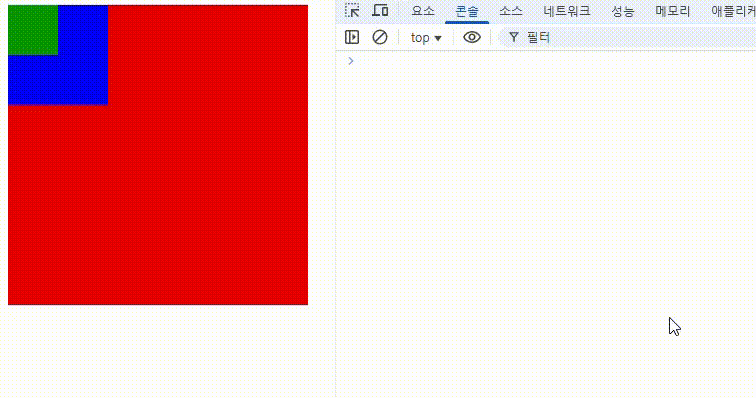
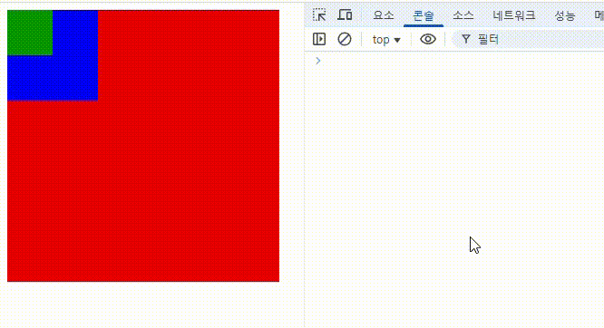

# 이벤트 위임(Event Delegation)

이벤트 위임은 이벤트 리스너를 부모 요소에 등록하여, 자식 요소에서 발생하는 이벤트를 부모 요소가 처리하도록 하는 기법입니다.

## 버블링과 캡처링

이벤트 전파 방식에는 **버블링(bubbling)**, **캡처링(capturing)** 두 가지가 있습니다.

- **버블링**: 이벤트가 가장 하위의 요소에서 시작하여 부모 요소로 전파되는 방식입니다. 기본적으로 대부분의 이벤트는 버블링 방식으로 전파됩니다.

```html
<div id="parent" style="width: 300px; height: 300px; background-color: red">
  <div id="child" style="width: 100px; height: 100px; background-color: blue">
    <div
      id="grandchild"
      style="width: 50px; height: 50px; background-color: green"
    ></div>
  </div>
</div>
<script>
  const parent = document.getElementById("parent");
  const child = document.getElementById("child");
  const grandchild = document.getElementById("grandchild");

  parent.addEventListener("click", (event) => {
    console.log("parent clicked");
    console.log(event.target.id);
    console.log(event.currentTarget.id);
  });

  child.addEventListener("click", (event) => {
    console.log("child clicked");
    console.log(`event.target.id: ${event.target.id}`);
    console.log(`event.currentTarget.id: ${event.currentTarget.id}`);
  });

  grandchild.addEventListener("click", (event) => {
    console.log("grandchild clicked");
    console.log(`event.target.id: ${event.target.id}`);
    console.log(`event.currentTarget.id: ${event.currentTarget.id}`);
  });
</script>
```

<br/>
위 예시에서 자식 요소를 클릭하면, 이벤트가 상위 요소로 전파되는 것을 확인 할 수 있습니다. `grandchild`를 클릭하면 `child`와 `parent`의 이벤트 리스너가 호출되는 것을 볼 수 있습니다.<br/>
콘솔을 확인해보면 `event.target`은 실제 이벤트가 발생한 요소, `event.currentTarget`은 이벤트 전파에 의해 현재 이벤트를 처리하고 있는 요소임을 확인할 수 있습니다.

- **캡처링**: 이벤트가 최상위 요소에서 시작하여 하위 요소로 전파되는 방식입니다. 캡처링을 사용하려면 `addEventListener`의 세 번째 인자로 `true`를 전달해야 합니다.

### 예시

```html
<div id="parent" style="width: 300px; height: 300px; background-color: red">
  <div id="child" style="width: 100px; height: 100px; background-color: blue">
    <div
      id="grandchild"
      style="width: 50px; height: 50px; background-color: green"
    ></div>
  </div>
</div>
<script>
  const parent = document.getElementById("parent");

  parent.addEventListener(
    "click",
    (event) => {
      console.log(`target: ${event.target.id}`);
      console.log(`currentTarget: ${event.currentTarget.id}`);
    },
    true
  );
</script>
```

<br/>
위의 예시에서 `parent`에만 클릭 이벤트 리스너를 등록했습니다. 결과를 보면 `child`와 `grandchild`를 클릭해도 이벤트가 발생하고 있습니다.<br/>
콘솔을 확인해보면 버블링과 마찬가지로 `event.target`은 실제 이벤트가 발생한 요소, `event.currentTarget`은 이벤트 전파에 의해 현재 이벤트를 처리하고 있는 요소임을 확인할 수 있습니다.

## 기본 원리

이벤트 위임은 이벤트가 발생한 요소에서부터 DOM 트리를 거슬러 올라가면서 이벤트를 처리하는 방식입니다. 이 과정에서 이벤트가 발생한 요소의 부모 요소에 등록된 이벤트 리스너가 호출됩니다.<br/><br/>
정리해보면 <strong>하위 요소에 각각 이벤트 리스너를 등록하지 않고, 상위 요소의 이벤트 리스너를 통해 하위 요소의 이벤트를 관리하는 방식</strong>입니다.

## 장점

1. **메모리 효율성**: 많은 자식 요소에 각각 이벤트 리스너를 등록하는 대신, 하나의 부모 요소에만 리스너를 등록하여 메모리를 절약할 수 있습니다.
2. **동적 요소 처리**: 페이지가 로드된 후에 추가된 자식 요소에 대해서도 자동으로 이벤트를 처리할 수 있습니다.
3. **코드 간결성**: 이벤트 리스너를 한 곳에 모아 관리할 수 있어 코드가 더 간결해집니다.

## 단점

1. **이벤트 전파**: 이벤트가 부모 요소로 전파되기 때문에, 특정 상황에서는 원치 않는 이벤트가 발생할 수 있습니다. 이를 방지하기 위해 `event.stopPropagation()`을 사용할 수 있습니다.
2. **성능 문제**: 너무 많은 자식 요소가 있을 경우, 이벤트가 부모 요소로 전파되는 과정에서 성능 저하가 발생할 수 있습니다.

## 참고 출처

- [MDN Web Docs - Event Delegation](https://developer.mozilla.org/en-US/docs/Learn/JavaScript/Building_blocks/Events#event_delegation)
- [캡틴판교 - 이벤트 위임](https://joshua1988.github.io/web-development/javascript/event-propagation-delegation/)
