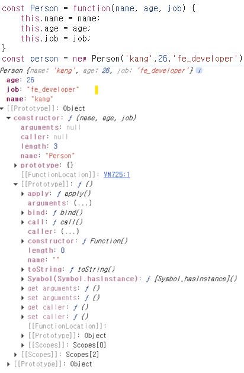

# 자바스크립트 프로토타입

## 1. 프로토타입이란?

- 자바스크립트는 프로토타입 기반의 객체 지향 언어입니다.
  > `객체 지향 언어(Object-Oriented Programming)`는 프로그램을 객체 단위로 구성하고 설계하는 방식입니다.
  >
  > > **객체 (Object)** : 속성과 데이터를 가진 데이터 집합. 예시로 `Person` 객체는 `이름`, `나이`, `성별`과 같은 속성을 가질 수 있습니다.
- 모든 객체는 다른 객체를 참조할 수 있는 `[[Prototype]]`이라는 내부 속성을 가집니다.
- 이 속성을 통해 객체는 자신의 프로토타입에서 속성과 메서드를 상속받습니다.

<br/>
위 예시에서 `new` 키워드로 `person`이라는 객체를 생성했습니다.<br/>
`person`은 기본적으로 `Object`의 프로토타입을 상속받는 것을 확인할 수 있습니다.

## 2. 프로토타입 체인

- 객체가 속성이나 메서드를 찾을 때, 먼저 자신의 속성을 확인하고, 없으면 프로토타입을 확인합니다.
- 이 과정을 프로토타입 체인이라고 하며, 최상위 프로토타입인 `Object.prototype`까지 이어집니다.

### 프로토타입 체인 동작 방식

```javascript
const upper = "kang".toUpperCase();

console.log(upper); // KANG
```

위 예시에서 `'kang'`이라는 문자열을 `toUpperCase()` 메서드를 사용해 대문자로 변환했습니다.<br/>
그런데 우리는 `toUpperCase()`라는 메서드를 선언한 적이 없습니다. 이는 `String` 객체의 프로토타입을 통해 메서드를 사용할 수 있는 것입니다.

- 'kang'이라는 `String`에는 `toUppereCase()`라는 메서드가 없음
- `String` 객체가 `String.prototype`을 참조
- `String.prototype`에 정의된 `toUpperCase()`를 호출해 대문자로 변환한 결과를 반환

## 3. 프로토타입 객체

- 모든 함수는 `prototype` 속성을 가지고 있으며, 이 속성은 해당 함수로 생성된 객체의 프로토타입으로 사용됩니다.
- 원시 타입의 경우, 객체를 생성하여 프로토타입을 활용할 수 있습니다.

## 4. 프로토타입에 속성 추가

- 프로토타입에 속성을 추가하면, 해당 프로토타입을 상속받는 모든 객체에서 이 속성을 사용할 수 있습니다.

```javascript
String.prototype.greet = function () {
  return `안녕하세요, ${this}!`;
};

const name = "Kang";
console.log(name.greet()); // 안녕하세요, Kang!
```

## 5. 프로토타입 메서드 오버라이딩

- 객체에서 프로토타입 메서드를 오버라이드할 수 있습니다. 이 경우, 객체에서 해당 메서드를 호출하면 프로토타입의 메서드가 아닌 객체의 메서드가 호출됩니다.

```javascript
String.prototype.greet = function () {
  return `안녕하세요, ${this}!`;
};

const name = "Kang";
console.log(name.greet()); // 안녕하세요, Kang!

// 메서드 오버라이드
String.prototype.greet = function () {
  return `안녕하세요, 저는 ${this}입니다.`;
};

console.log(name.greet()); // 안녕하세요, 저는 Kang입니다.
```

## 6. `Object.create()`

- `Object.create()` 메서드를 사용하여 특정 프로토타입을 가진 객체를 생성할 수 있습니다.

```javascript
const animal = {
  speak: function () {
    console.log("동물이 소리를 냅니다.");
  },
};

const dog = Object.create(animal);
dog.speak(); // 동물이 소리를 냅니다.
```

## 7. 프로토타입의 중요성

- 프로토타입을 이해하면 자바스크립트의 객체 지향 프로그래밍을 더 잘 활용할 수 있습니다.
- 코드의 재사용성을 높이고, 메모리 사용을 최적화할 수 있습니다.

## 참고 출처

- [MDN Web Docs - Prototypes](https://developer.mozilla.org/en-US/docs/Learn/JavaScript/Objects/Inheritance#prototypes)
- [JavaScript.info - Prototypes](https://javascript.info/prototype-inheritance)
