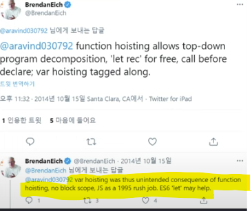

# 호이스팅

## 호이스팅 개념

호이스팅은 자바스크립트 엔진이 변수나 함수의 선언을 스코프의 최상단으로 끌어 올리는 것을 말합니다. 이때 변수의 선언과 초기화를 분리한 후, 선언만 최상단으로 끌어 올립니다.<br/>
간단히 말해, 코드 상에서 변수나 함수를 선언하기 전에 참조할 수 있는 것입니다.

> 참고로 호이스팅은 `JavaScript` 개발 과정에서 실수로 생긴 버그라고 하네요.<br/> >
> 

## 변수 호이스팅

변수의 호이스팅 예시를 보기 전에 먼저, 변수의 생성 과정을 간단하게 살펴보겠습니다. <br/><br/>
변수의 생성은 `선언 단계` -> `초기화 단계` -> `할당 단계` 이렇게 총 3단계로 나눠집니다.<br/>이때 `var`로 선언한 변수는 선언 단계에서 `undefined`를 할당하는 과정(`초기화`)이 동시에 진행됩니다.<br/>
반면 `let`과 `const`로 선언한 변수는 선언 단계에서 초기화 과정이 진행되지 않습니다.

### var로 선언한 변수의 호이스팅

```javascript
console.log(a); // undefined
var a = 1;
console.log(a); // 1
```

위 코드를 보면 `a`를 `var`로 선언했기 때문에, 선언 전에 `console.log(a)`가 `undefined`를 출력했습니다.<br/><br/>
JS 내부의 호이스팅 결과를 살펴보면 아래와 같습니다.

```javascript
var a; // 선언과 초기화가 동시에(자동으로 undefined로 초기화)

console.log(a); // undefined
a = 1;
console.log(a); // 1
```

### let과 const로 선언한 변수의 호이스팅

```javascript
console.log(a); // ReferenceError: Cannot access 'a' before initialization
let a = 1;

console.log(b); // ReferenceError: Cannot access 'b' before initialization
const b = 2;
```

위 코드를 보면 `a`와 `b`가 선언되기 전에 참조한 경우 `참조 오류`가 발생합니다. `참조 오류`가 발생했다고 해서 호이스팅이 발생하지 않은 것은 아닙니다. `var`과 다르게 초기화되기 전까지 `TDZ`에 머물러 있기 때문입니다.<br/><br/>
여기서 살펴볼 개념이 `TDZ(Temporal Dead Zone)`입니다.

### TDZ(Temporal Dead Zone) - 일시적 사각지대

`TDZ`는 `let`과 `const`로 변수를 선언할 때 발생하는 개념으로, 변수가 선언된 시점부터 초기화되기 전까지의 구간을 의미합니다. `TDZ` 동안 변수에 접근하면 `ReferenceError`가 발생하고 `TDZ`가 종료되어야 변수에 정상적으로 접근할 수 있습니다.<br/><br/>
즉, `let`과 `const`의 호이스팅에서 `ReferenceError`가 발생한 것은 `let`과 `const`는 호이스팅 되었지만 `TDZ`에 있기 때문입니다.

```javascript
console.log(a); // ReferenceError: Cannot access 'a' before initialization
let a = 1;
```

JS 내부의 호이스팅 결과를 살펴보면 아래와 같습니다.

```javascript
let a; // 선언만 호이스팅 (초기화 ❌)
console.log(a); // ReferenceError: Cannot access 'a' before initialization
a = 1; // 초기화 및 할당
```

`let`과 `const`의 호이스팅은 선언과 초기화중 `선언`만을 호이스팅하고 초기화는 실제 코드에 도달했을 때 이루어집니다.

## 함수의 호이스팅

### 함수 선언식

```javascript
func(); // "함수 선언식"

function func() {
  console.log("함수 선언식");
}
```

함수 선언식은 호이스팅 됩니다.

### 함수 표현식 및 화살표 함수

```javascript
func(); // ReferenceError: Cannot access 'func' before initialization
const func = function () {
  console.log("함수 표현식");
};

console.log(arrowFunc); // ReferenceError: Cannot access 'arrowFunc' before initialization
const arrowFunc = () => {
  console.log("화살표 함수");
};
```

함수 표현식은 호이스팅 되지 않습니다.

## 정리

💡 호이스팅(hoisting) 가능/불가능 요소

- 변수: var (가능 - 선언과 초기화가 동시 진행), let/const (선언만 가능, 초기화는 실제 코드에 도달했을 때 진행)
- 함수 선언식 (function declaration): 가능
- 함수 표현식 (function expression) 및 화살표 함수: 불가능
- 클래스 (class): 선언만 호이스팅 (초기화되지 않음)

💡 TDZ에 영향을 받는 요소

- let, const로 선언된 변수
- class 선언
- import된 모듈
